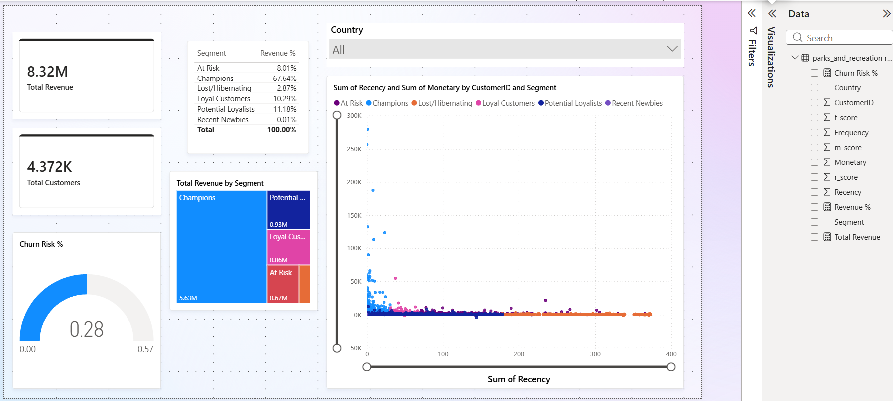

# 📊 Customer Segmentation & Revenue Analysis (RFM Model)

  

## 🔍 Problem Statement
Businesses often struggle to identify their most valuable customers and reduce churn.  
This project solves that problem using **RFM (Recency, Frequency, Monetary) analysis** to segment customers and drive targeted marketing strategies.

---

## 📌 Project Overview
This project analyzes customer transaction data using **MySQL** and visualizes insights in **Power BI**.

The objective is to:
- Segment customers based on purchasing behavior  
- Identify high-value and at-risk customers  
- Provide actionable business recommendations  

---

## 🚀 Key Insights
- 💰 **Total Revenue:** 8.32M  
- 👥 **Total Customers:** 4,372  
- 🏆 **Champions contribute ~67% of total revenue**  
- ⚠️ **At-risk customers identified for re-engagement**  
- 📉 **Churn risk estimated at ~28%**

---

## 🛠️ Tech Stack
- **Database:** MySQL  
- **Visualization:** Power BI  
- **Language:** SQL (CTEs, Window Functions, Aggregations)  

---
## 📊 Dataset
The dataset used for this project is publicly available:

🔗 [Online Retail Dataset](https://archive.ics.uci.edu/dataset/352/online+retail)

This dataset contains transactional data including:
- Invoice details  
- Customer IDs  
- Purchase quantities  
- Pricing and country information  

---

## ⚙️ Data Processing & SQL Workflow

👉 [View SQL Script](./rfm_analysis.sql)

### Steps performed:

### 1. Data Cleaning
- Removed null/invalid Customer IDs  
- Converted text dates into proper datetime format  
- Created `TotalAmount` column  

### 2. Feature Engineering
- **Recency** → Days since last purchase  
- **Frequency** → Number of transactions  
- **Monetary** → Total spend  

### 3. RFM Scoring
- Used `NTILE(5)` to divide customers into 5 groups  
- Generated:
  - r_score  
  - f_score  
  - m_score  

### 4. Customer Segmentation
- Champions  
- Loyal Customers  
- Potential Loyalists  
- At Risk  
- Lost / Hibernating  

---

## 📊 Dashboard Features (Power BI)
- KPI Cards (Revenue, Customers)  
- Revenue contribution by segment (Treemap)  
- Churn risk visualization  
- Scatter plot (Recency vs Monetary)  
- Country-level filtering  

---

## 📈 Business Recommendations

| Segment | Strategy |
|--------|---------|
| Champions | Reward with loyalty programs & VIP access |
| Loyal Customers | Upsell premium/high-margin products |
| Potential Loyalists | Personalized offers to increase engagement |
| At Risk | Win-back campaigns (discounts, emails) |
| Lost Customers | Reduce marketing spend |

---

## 💡 What This Project Demonstrates
- Strong understanding of **customer analytics & segmentation**  
- Ability to **convert data into actionable insights**  
- Hands-on experience with:
  - SQL transformations  
  - Data modeling  
  - Dashboard storytelling  

---

## ⭐ If you found this useful
Give this repo a ⭐ — it helps a lot!

---
